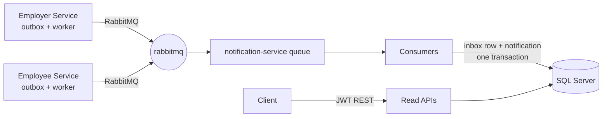

# Notification Service

In-app notification microservice for the JobBoard platform. Consumes integration events from the
Employer and Employee services over RabbitMQ (MassTransit), persists them to SQL Server, and
exposes read APIs for users to list and manage their notifications.

## Architecture



### Events consumed (`JobBoard.Contracts`)

| Event | Trigger | Recipient | Type |
|---|---|---|---|
| `ApplicationSubmittedEvent` | candidate applies | Employer user | `ApplicationSubmitted` |
| `JobPostedEvent` | recruiter posts a job (fan-out per `RecipientUserIds`) | Employee users | `JobPosted` |
| `ApplicationStatusChangedEvent` | Seen / ResumeAccepted / ResumeRejected / InterviewScheduled / Hired | Candidate | `ApplicationStatusChanged` |

### Idempotency (exactly-once effect)

Producers use a transactional outbox; each event carries a unique `EventId`.
On consumption this service:

1. checks an **`InboxMessages`** table keyed by that id (PK = unique index),
2. inserts the inbox row **and** the notification(s) in the **same EF Core save/transaction**,
3. treats any unique-constraint violation as "already processed" (concurrent-duplicate safety).

A redelivered event is therefore acknowledged with zero side effects.
Delivery remains at-least-once at the broker level — dedupe makes the end result effectively-once.

Resilience: MassTransit retry intervals 1s/5s/15s, then the message faults to the default
`notification-service_error` DLQ. Health: `/health` (SQL Server + RabbitMQ). Logging: Serilog.

## Projects

```
NotificationService.Domain          entities/enums (no dependencies)
NotificationService.Application     abstractions, DTOs, event->notification mapping
NotificationService.Infrastructure  EF Core, repositories, MassTransit consumers, inbox guard
NotificationService.Api             controllers, auth, health checks, dev simulation endpoints
NotificationService.Tests           xUnit + SQLite in-memory + MassTransit test harness
JobBoard.Contracts                  shared integration-event records (referenced)
```

## Run

### Docker Compose (recommended)

```bash
cd src/NotificationService
docker compose up --build
```

- API + Swagger: http://localhost:8080/swagger (Development => auto-migrates on startup)
- RabbitMQ UI: http://localhost:15672 (guest/guest)

### Local (no Docker)

Requires SQL Server reachable via `ConnectionStrings:DefaultDb`, then:

```bash
dotnet tool restore                      # pins dotnet-ef 8.x from ../.. /.config
dotnet ef database update \
  --project NotificationService.Infrastructure \
  --startup-project NotificationService.Api
dotnet run --project NotificationService.Api
```

> Note: projects target net8.0 but carry `<RollForward>LatestMajor</RollForward>` so they also run
> on machines where only newer ASP.NET Core shared frameworks are installed.

## Dev-only helpers (enabled when `Auth:DevEnabled=true`)

Mint a token (HS256; issuer/audience `JobBoard`; `sub` = user id):

```http
POST /api/dev/token
{ "userId": "11111111-1111-1111-1111-111111111111", "role": "Employer" }
```

Publish a sample event through the real bus (exercises consume -> persist loop without the
publisher services):

```http
POST /api/dev/publish-test-event
{ "eventType": "ApplicationStatusChanged", "status": 4 }   // InterviewScheduled
```

`eventType`: `ApplicationSubmitted` | `JobPosted` | `ApplicationStatusChanged`
(`status`: 1 Seen .. 5 Hired).

## Read APIs (JWT Bearer)

| Method | Route | Notes |
|---|---|---|
| GET | `/api/notifications?pageNumber=&pageSize=&type=&isRead=` | paged, newest first, own only |
| GET | `/api/notifications/unread-count` | |
| POST | `/api/notifications/{id}/mark-as-read` | 404 unless owned by caller; idempotent |
| POST | `/api/notifications/mark-all-as-read` | returns `{ updated }` |
| GET | `/health` | sqlserver + rabbitmq checks |

## Tests

```bash
dotnet test src/NotificationService
```

17 tests cover: ingestion per event type, job-posted fan-out (incl. empty recipient list),
**redelivery dedupe proof** (same EventId consumed twice -> exactly one notification),
per-status message mapping, mark-as-read scoping/idempotency, unread counts, paging/filtering,
and metadata serialization.
